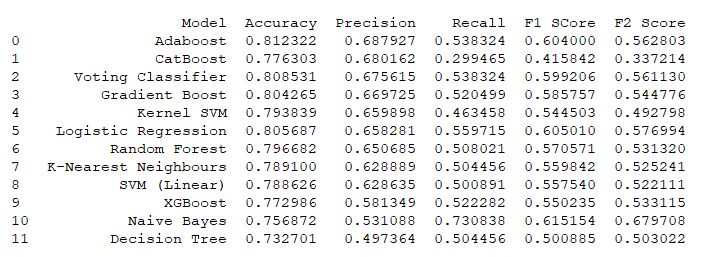
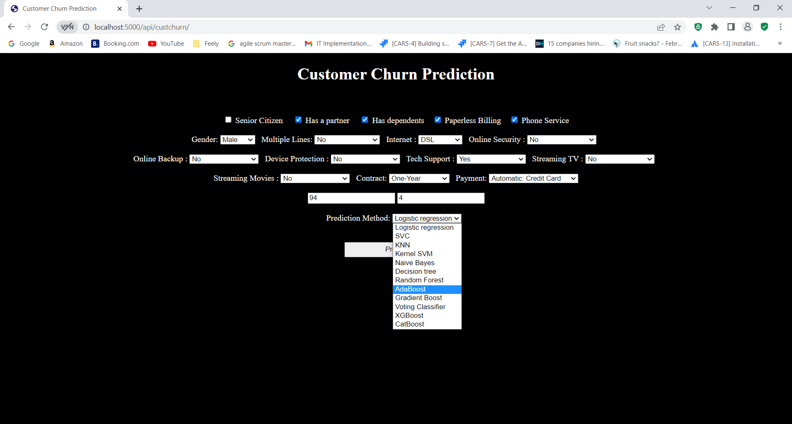
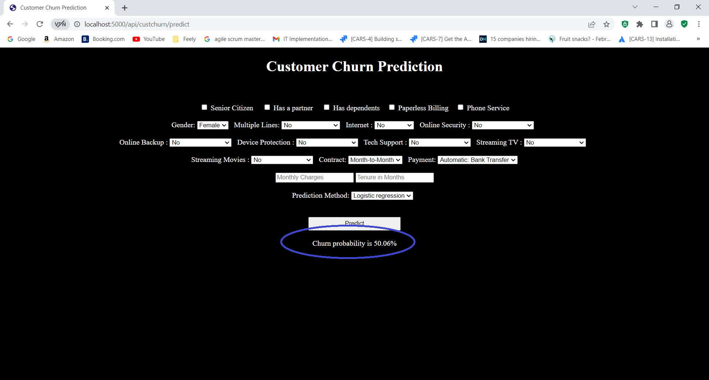
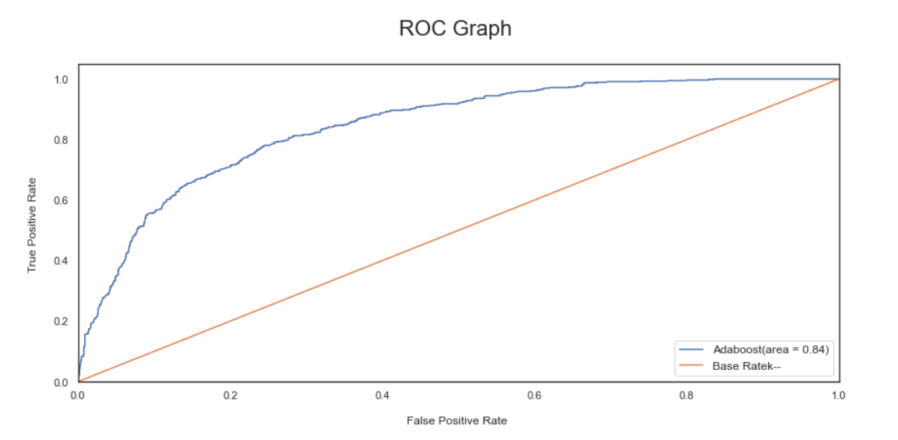
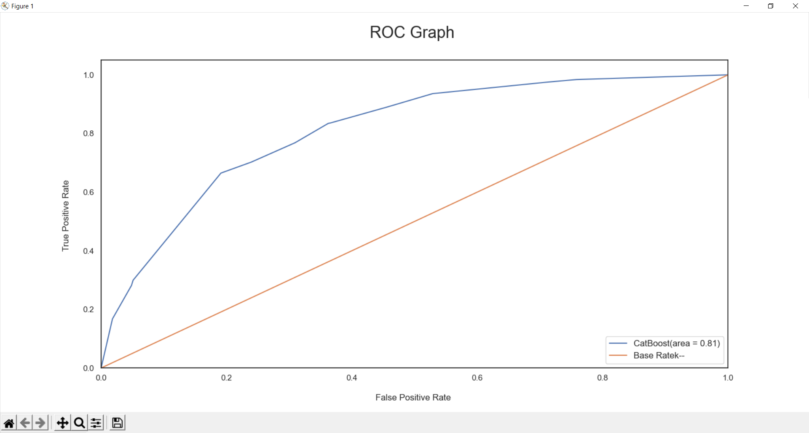
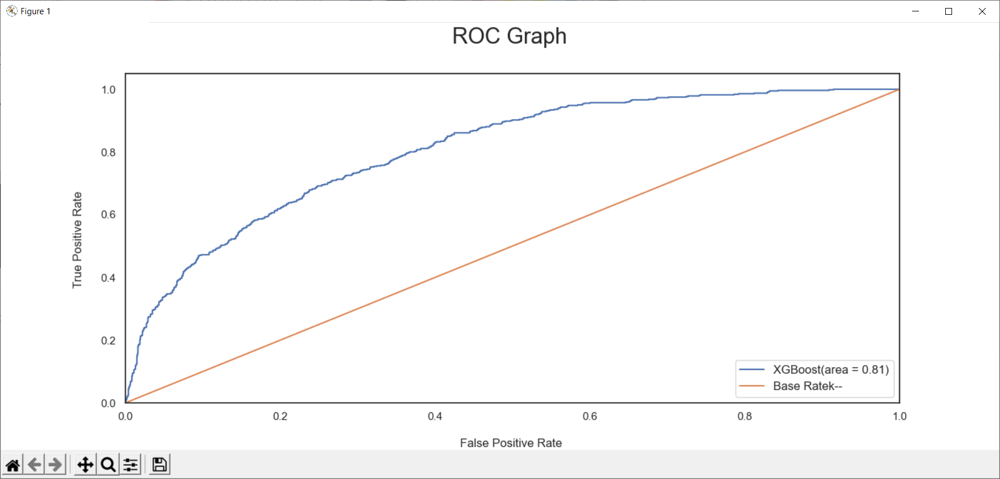

# 
Demo Data for Internet Customer Churn Prediction

The Foghlaim Meaisin Software recently launched the Foghlaim Meaisin Internet Customer Churn Prediction software

Our homepage is here

https://foghlaimmeaisin.com/

You can try our demo data onto the Internet Customer Churn Prediction System here

https://github.com/mekongsoft/custchurn-demo

We have created 12 models to compare their performances on Internet Customer Churn Prediction

* Adaboost
* CatBoost
* Decision Tree Classifier
* Gaussian NB
* Gradient boost classifier
* Kernel SVM
* KNN
* Logistic Regression
* Random Forest
* SVC
* Voting Classifier
* XGBoost

in which the performance of Adaboost has been the best model to predict Internet Customer Churn,

This is our accuracy evaluation

So the best is Adaboost (81.23%), the second is Voting Classifier (80.85%), the third is Logistic Regression (80.57%) and the fourth is Gradient Boost (80.42%), then the rest are below 80%.

This is how we work:

On our web form, enter the parameter for an Internet Customer, then select one of the 12 models as below

Then click Predict button to know the possibility if this Customer can churn or not

These below are the True Positive rate for Adaboost, CatBoost and XGBoost

We have also reached the similar conclusions to Internet Customer Churn Prediction:

1. Internet customers with Month-to-Month Contract opted to move out than One-Year Contracted or Two-Year Contracted customers
2. Internet customers who pay by Credit-Card Automatic Transfer, Bank Automatic Transfer or Mailed Check are less likely to churn
3. Internet customers having DSL service are less likely to churn than Fibre optic service
4. Internet customers without dependents are more likely to churn
5. Internet customers churn due to lack of online security
6. Most of the senior (elder) Internet customers churn
7. Internet customers with Paperless Billing are more likely to churn
8. Internet customers with no TechSupport are more likely to churn
9. Internet customers with higher Monthly Charges are also more likely to churn
10. Newer Internet customers are more likely to churn

This Repo is for Marketing Demo tasks.

https://github.com/mekongsoft/custchurn-demo

COPYRIGHT@2023 OF FOGHLAIM MEAISIN SOFTWARE, CALGARY, ALBERTA, CANADA.